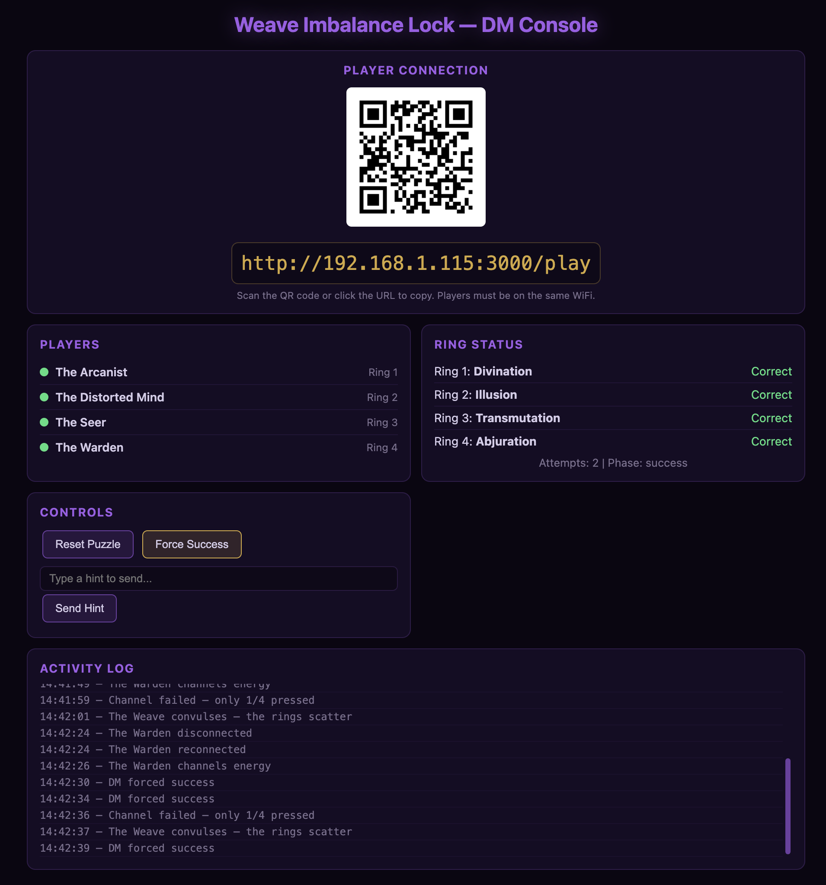
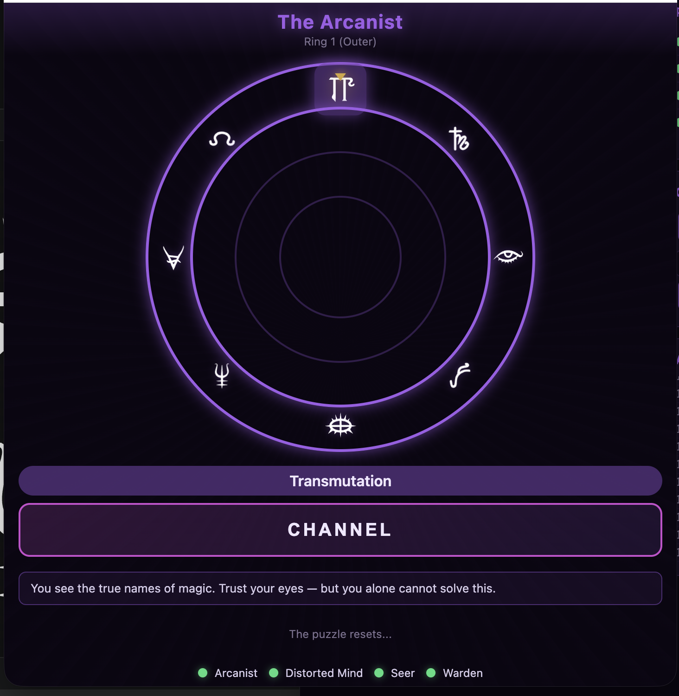

# Weave Imbalance Lock

A real-time multiplayer DnD puzzle for 4 players, themed around the fractured Weave and arcane delirium. Players must align 4 concentric rings of magic schools and channel simultaneously to break the magical lock.

Designed as a one-shot puzzle prop — the DM hosts the server on a laptop, and players join via their phones over local WiFi.

| DM Console (laptop) | Player View (phone) |
|---|---|
|  |  |

## Running

Requires Node.js.

```bash
npm install
node server.js
```

The DM console shows a QR code for the player URL — players can scan it with their phones to join.

### Running with Docker

A `Dockerfile` and `run.sh` helper are included. Requires Docker.

```bash
./run.sh
```

## The Puzzle

The lock is a fragment of the fractured Weave. It manifests as **4 concentric rings**, each marked with the **8 schools of magic** (Abjuration, Conjuration, Divination, Enchantment, Evocation, Illusion, Necromancy, Transmutation). The schools appear on each ring in a *different random order*, so players cannot rely on memorized positions.

Each ring rotates independently. The "selected" school on each ring is the one at the **top position** (12 o'clock). To break the lock, the four selected schools across the rings must satisfy the hidden arcane laws — and all four players must commit simultaneously by pressing **Channel** within a ~2 second window.

But no single player can solve it alone: each one perceives the Weave through a different fracture, and only by combining their fragmented truths can they align the rings.

### The Four Roles

#### 🜂 The Arcanist — *Truth*
> *"You see the true names of magic. Trust your eyes — but you alone cannot solve this."*

The Arcanist controls the **outer ring** and is the only player who can read the school name labels — but only on their own ring. They see the rune for the currently selected school appear in a purple pill above the Channel button, telling them exactly which school they're aligned to. The Arcanist is the **translator**.

#### 🜄 The Distorted Mind — *Corruption*
> *"The Weave distorts your vision."*

The Distorted Mind controls the **second ring**. Their reality is unstable: every 5 seconds, **4 random glyphs on their ring are replaced by glitching crystals**, hiding the runes underneath. They must wait for the corruption to shift before they can see what's actually on their ring.

#### 🜁 The Seer — *Awareness*
> *"You perceive the magic permeating the rings. The names are hidden, but your awareness is limitless."*

The Seer controls the **third ring** but sees **every glyph on every ring**. They are the only player with full visibility of the puzzle's current state. The names of the schools are still hidden,

#### 🜃 The Warden — *Binding*
> *"You bind the Weave, but it answers in kind — each turn of your ring sends ripples through the others, shifting their alignment."*

The Warden controls the **inner ring**. Every time they rotate their ring by one position, **other rings are randomly shifted by 1–3 positions** in random directions.

The Warden is also the keeper of a cryptic riddle that hints at the solution:
> *"The Weave broke when truth saw madness, sight became change, and the final hand chose protection over power."*

This forces the Warden to be careful — every adjustment risks unraveling the others' work.

### Interaction

- **Rotate** by dragging on the ring area (or using mouse drag on desktop). Each 45° rotation advances one position.
- **Other players' rings** are hidden — you only see a faint purple selection marker at their top position. The actual glyphs are revealed briefly only while channeling.
- **Press Channel** when you believe the lock is aligned. All four players must press within a few seconds.
- **Failure** scatters all rings to random positions, accompanied by a glass-cracking sound, screen shake, and a partial hint about which rule was broken.
- **Success** locks the rings in golden light. The Weave is restored.

### The Hidden Laws (Validation Rules)

The four selected schools (one per ring, outer → inner) must satisfy:
The hardcoded solution: **Divination · Illusion · Transmutation · Abjuration** (outer → inner).

This decodes the Warden's riddle:
- *"truth"* = Divination (R1)
- *"madness"* = Illusion (R2)
- *"change"* = Transmutation (R3)
- *"protection over power"* = Abjuration (R4)

## DM Console

At `http://<local-ip>:3000/console`. The laptop browser shows:
- **QR code + URL** for players to join
- **Player connection status** (which roles are filled)
- **Live ring state** with truth labels and correct/incorrect indicators
- **Manual hint sender** — typed hints appear as a purple pill above the players' Channel button
- **Reset / Force Success** buttons (safety net if players are stuck)
- **Activity log** of all rotations and channel attempts

## Solo Playtest

You can test the entire puzzle alone on the host laptop — useful before running it with players.

1. Start the server: `node server.js`
2. Open **5 browser tabs** on the laptop:
   - 1 tab: `http://localhost:3000/console` — DM console
   - 4 tabs: `http://localhost:3000/play` — one for each role
3. Each player tab will be auto-assigned to the next available role in order: Arcanist → Distorted Mind → Seer → Warden.
4. Drag in each ring tab to rotate, then press **Channel** in all four within the timeout window (default 5 s).
5. Use the DM console to monitor state in real time. The DM tab also shows the correct/incorrect status for each ring — useful for verifying the solution.
6. **Force Success** on the DM console will trigger the win state without solving the puzzle, if you want to verify the success animation/sound.

## Configuration

Server behavior is controlled by `config.json` in the project root. Edit and restart the server to apply changes.

```json
{
  "port": 3000,
  "channelTimeoutMs": 5000,
  "scatterDelayMs": 1500,
  "disconnectGraceMs": 3000,
  "wardenSpinChance": 1.0,
  "solution": ["Divination", "Illusion", "Transmutation", "Abjuration"],
  "wardenRiddle": "The Weave broke when truth saw madness, sight became change, and the final hand chose protection over power.",
  "failureHints": { "...": "see below" }
}
```

| Option | Default | Description |
|---|---|---|
| `port` | `3000` | HTTP/WebSocket port the server listens on |
| `channelTimeoutMs` | `5000` | Window (ms) for all players to press Channel after the first press. If the timeout expires before everyone presses, the channel fails and rings scatter. |
| `scatterDelayMs` | `1500` | Delay (ms) between a failed channel attempt and the random scatter of the rings. Gives players time to read the failure hint. |
| `disconnectGraceMs` | `3000` | Time (ms) a disconnected player's role is held before being freed for someone else. Allows brief WiFi drops or page reloads. |
| `wardenSpinChance` | `1.0` | Probability (0.0–1.0) that the Warden's curse triggers on each rotation. At `1.0` every Warden rotation spins 1–3 other rings. Lower it (e.g. `0.5`) to make the Warden's effect less constant. |
| `solution` | `["Divination", "Illusion", "Transmutation", "Abjuration"]` | Target school for each ring (outer→inner). Change this to use a different solution. School names must match the canonical 8 schools (Abjuration, Conjuration, Divination, Enchantment, Evocation, Illusion, Necromancy, Transmutation). |
| `wardenRiddle` | *(see config.json)* | The cryptic riddle shown to the Warden as a hint toward the solution. Customize this to match your puzzle's flavor. |
| `failureHints` | *(see config.json)* | Map of rule-violation keys to hint text shown after a failed attempt. Keys: `flow_broken` (chain order broken), `anchor_invalid` (outer ring is wrong), `channel_not_unified` (not all players pressed Channel). Override any subset; missing keys fall back to defaults. |

If `config.json` is missing or invalid, the server falls back to the defaults above and logs a notice on startup.

## Tech Stack

- Node.js + `ws` (WebSockets) — single dependency
- Vanilla HTML/CSS/JS — no build step, no framework
- Works offline on any local WiFi

## Project Structure

```
server.js                Game state, validation, WebSocket sync
public/
  player.html            Player view (served at / and /play)
  dm.html                DM console (served at /console)
  css/styles.css         Rings, animations, delirium theme
  js/
    rings.js             Ring rendering and touch rotation
    roles.js             Role-specific view logic
    client.js            WebSocket client, audio, UI
    qrcode.min.js        QR code generator for DM console
  img/
    schools.svg          Magic school runes (sprite sheet)
    crystal.svg          Glitch effect for Distorted Mind
  audio/
    glass-crack.mp3      Failure sound
```
